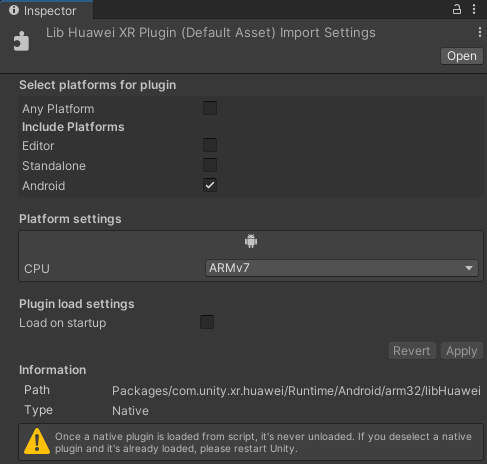
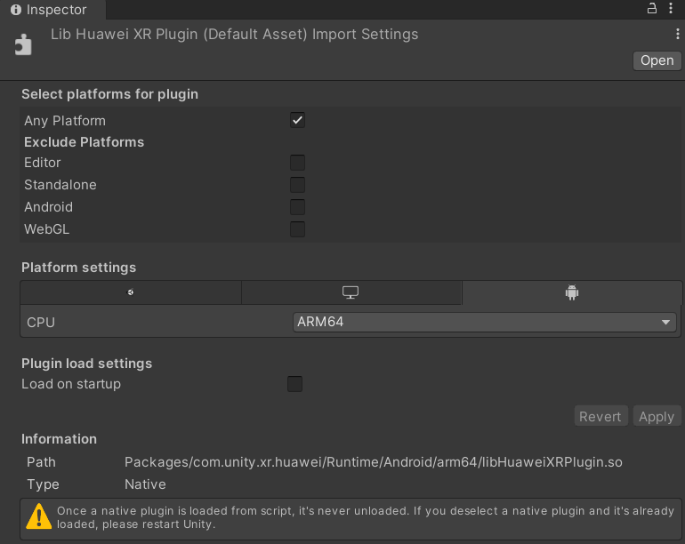

# Huawei XR Plugin

This package provides XR Plugin support for Huawei VR devices. The developer can build Unity applications with this package runing on Huawei VR devices. You can get more information from
[Huawei VR Engine](https://developer.huawei.com/consumer/cn/doc/development/graphics-Guides/introduction-0000001097358942) and [Unity XR System](https://docs.unity3d.com/Manual/XR.html).

Warning：Current package is preview version. 

## Unity Version
* Unity 2019.4.f15 and above

## Installing Huawei XR Plugin

To install this package, follow the instructions in the [Installing a package from a local folder](https://docs.unity3d.com/Manual/upm-ui-local.html).

Then check platforms for `com.unity.xr.hvrsdk/Runtime/Android/arm32`  library files as shown below.

Then check platforms for `com.unity.xr.hvrsdk/Runtime/Android/arm64`  library files as shown below.

## Documentation

* [Manual](Documentation~/com.unity.xr.hvrsdk.md)
* [Quick Start](Documentation~/QuickStart.md)
